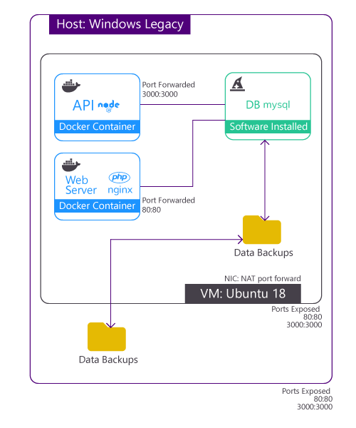

# Máquina Virtual Base App Servers

Se trata de una máquina virtual Ubuntu 18 con MySQL y docker lista para ser utilizada.

## Prerequisitos
1. 	Instalar Vagrant y Virtual Box
2. 	Contar con una conexión a internet

## ¿Cómo usarla?
Para poner en marcha por primera vez la máquina virtual hay que verificar que en el carchivo Vagrantfile esté descomentada la línea: 
`config.vm.provision :shell, path: "./provision/bootstrap.sh"`

Además hay que comentar la línea:
`config.vm.provision :shell, path: "./provision/reboot.sh"`

### Windows
Para correr en windows la máquina virtual hay que ejecutar el .bat:
+ Powershell
`.\commands\up_machine.bat`
+ cmd
`commands\up_machine.bat`

Luego de unos minutos se creará una máquina virtual con todo listo para ser usada, para probar que está corriendo adecuadamente basta con abrir un navegador e ir a la dirección: [http://192.168.33.10/](http://192.168.33.10/)

Si todo salió bien mostrará una página de bienvenida de NGINX

### Mac OS
Para correr en MacOS la máquina virtual hay que ejecutar el comando en la terminal:
+ Terminal
`vagrant up --provision`


Luego de unos minutos se creará una máquina virtual con todo listo para ser usada, para probar que está corriendo adecuadamente basta con abrir un navegador e ir a la dirección: [http://192.168.33.10/](http://192.168.33.10/)

Si todo salió bien mostrará una página de bienvenida de NGINX

### Conectar a MySQL
Por defaul la configuración de la máquina tiene las siguientes credenciales:
- **ip**: 192.168.33.10
- **puerto**: 3306
- **usuario**: root
- **password**: root


### Configurar backups de mysql

Para ejecutar un respaldo de los datos de forma manual
1. Ir a la carpeta compartida: `$ cd /vagrant`
2. Ejecutar un respaldo:
`$ sudo mysqldump -u root <nombreTabla> > <nombreTabla>.sql`
  
Ejemplo: 
`$ sudo mysqldump -u root sys > ./data/myDb.sql`
    
##### Nota: En caso de mandar error
Ejecutar el siguiente código en shell de vagrant y volver a intentar el respaldo.
```
cd ~
sudo echo "[mysqldump]" >> ~/.my.cnf
sudo echo "user=root" >> ~/.my.cnf
sudo echo "password=root" >> ~/.my.cnf
cd /vagrant

```

Si se ejecuta el respaldo dentro de **/vagrant** los archivos .sql generados se almacenarán en el host, lo que permitirá automatizar los backups de la base de datos y archivar la información en otros servidores.

## Arquitectura
Para agilizar el flujo de desarrollo, homologar los ambientes de, integración y despliegue de servicios web, además de separar por completo la infraestructura del código. Nace esta propuesta con la finalidad de reutilizar equipos en buen estado con versiones de Windows como 7, 2012 R2 o 10 Home. También es compatible con sistemas operativos Linux y Mac.

Cada desarrollo se va a dividir en pequeños trozos de software que funcionarán como micro servicios y se comunicarán entre sí mediante APIs.

Gracias a esta arquitectura se podrán homologar los ambientes de desarrollo, pruebas y producción.



